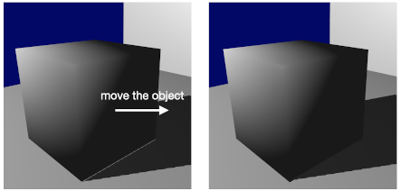

# shadowMapping

Shadow mapping is one of the real-time shadow rendering techniques.
It uses a depth map which is rendered from a light source.
By comparing the value of the depth map with the depth value of a certain fragment,
the fragment is decided to be whether in shadow or not.

# License

The MIT License (MIT)

Copyright (c) 2021, Jiang Ye

Permission is hereby granted, free of charge, to any person obtaining a copy of this software and associated documentation files (the "Software"), to deal in the Software without restriction, including without limitation the rights to use, copy, modify, merge, publish, distribute, sublicense, and/or sell copies of the Software, and to permit persons to whom the Software is furnished to do so, subject to the following conditions:

The above copyright notice and this permission notice shall be included in all copies or substantial portions of the Software.

THE SOFTWARE IS PROVIDED "AS IS", WITHOUT WARRANTY OF ANY KIND, EXPRESS OR IMPLIED, INCLUDING BUT NOT LIMITED TO THE WARRANTIES OF MERCHANTABILITY, FITNESS FOR A PARTICULAR PURPOSE AND NONINFRINGEMENT. IN NO EVENT SHALL THE AUTHORS OR COPYRIGHT HOLDERS BE LIABLE FOR ANY CLAIM, DAMAGES OR OTHER LIABILITY, WHETHER IN AN ACTION OF CONTRACT, TORT OR OTHERWISE, ARISING FROM, OUT OF OR IN CONNECTION WITH THE SOFTWARE OR THE USE OR OTHER DEALINGS IN THE SOFTWARE.

# Note

There are two common artifacts in shadow mapping: shadow acne and peter panning.

Shadow acne occurs because of the discrete process of rasterization.
Different fragments may access the same texel in the depth map.
As a result,  moire-like pattern shadows occur.

Usually, an offset (or depth bias) is added to the depth map to mitigate shadow acne.
However, if the depth bias is too large, shadows will detach from objects.
This artifact is called peter panning.
For a floating object, this may not be a problem.
But for an object that is on the ground,
peter panning is quite annoying.

## Slope-scale depth bias

Instead of using a static depth bias,
calculate the bias based on the depth slope of an object.
According to [3], `glPolygonOffset` is the built-in slope-scale depth bias in OpenGL.

## Back face and front face

When generating depth map, `glCullFace(GL_FRONT)` can also mitigate shadow acne.
But as a side effect, it may aggravate peter panning.

## A trick to avoid peter panning

I separate the scene and shadows into different rendering procedures.

-   First, the scene without shadows is rendered into a texture (`sceneTex`).

-   Second, shadows are rendered based on depth map.
    The scene color from `sceneTex` is blended with the shadow for each fragment.
    Fragments which are not in shadow are discarded.

-   Third, the remaining scene is rendered.
    A small offset along `lightDirection` is added into the model matrix.
    This offset avoids the gap between objects and their shadows.
    Hence, the peter panning artifact is avoided.

# Reference

[1] LearnOpenGL: Shadow Mapping ([link](https://learnopengl.com/Advanced-Lighting/Shadows/Shadow-Mapping))

[2] Common Techniques to Improve Shadow Depth Maps ([link](https://docs.microsoft.com/en-us/windows/win32/dxtecharts/common-techniques-to-improve-shadow-depth-maps?redirectedfrom=MSDN))

[3] OpenGL built-in Slope-Scale Depth Bias: [glPolygonOffset](https://community.khronos.org/t/slope-scale-depth-bias-in-opengl-3-2-core/62194/3)
