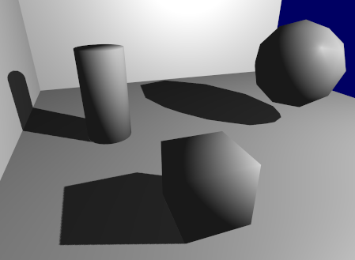

# shadowMapping

Shadow mapping is one of the real-time shadow rendering techniques.
It uses a depth map which is rendered from a light source.
By comparing the value of the depth map with the depth value of a certain fragment,
the fragment is decided to be whether in shadow or not.

# Note

There are two common artifacts in shadow mapping: shadow acne and peter panning.

Shadow acne occurs because of the discrete process of rasterization.
Different fragments may access the same texel in the depth map.
As a result,  moire-like pattern shadows occur.

Usually, an offset (or depth bias) is added to the depth map to mitigate shadow acne.
However, if the depth bias is too large, shadows will detach from objects.
This artifact is called peter panning.
For a floating object, this may not be a problem.
But for an object that is on the ground,
peter panning is quite annoying.

## Slope-scale depth bias

Instead of using a static depth bias,
calculate the bias based on the depth slope of an object.
According to [3], `glPolygonOffset` is the built-in slope-scale depth bias in OpenGL.

## Back face and front face

When generating depth map, `glCullFace(GL_FRONT)` can also mitigate shadow acne.
But as a side effect, it may aggravate peter panning.

# Result

# Reference

[1] LearnOpenGL: Shadow Mapping ([link](https://learnopengl.com/Advanced-Lighting/Shadows/Shadow-Mapping))

[2] Common Techniques to Improve Shadow Depth Maps ([link](https://docs.microsoft.com/en-us/windows/win32/dxtecharts/common-techniques-to-improve-shadow-depth-maps?redirectedfrom=MSDN))

[3] OpenGL built-in Slope-Scale Depth Bias: [glPolygonOffset](https://community.khronos.org/t/slope-scale-depth-bias-in-opengl-3-2-core/62194/3)
